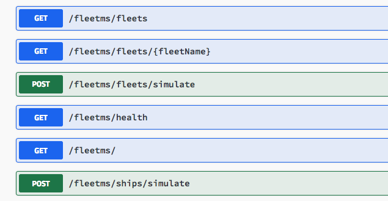
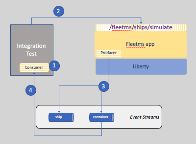

# Fleet manager microservice

This microservice is responsible to manage fleet of container carrier ships. It exposes simple REST API to support getting ships and fleets, and start and stop simulator.

## Pre-Requisites

* [Maven](https://maven.apache.org/install.html) used to compile and package the application.
* Java 8: Any compliant JVM should work.
  * [Java 8 JDK from Oracle](http://www.oracle.com/technetwork/java/javase/downloads/index.html)
  * [Java 8 JDK from IBM (AIX, Linux, z/OS, IBM i)](http://www.ibm.com/developerworks/java/jdk/),
    or [Download a Liberty server package](https://developer.ibm.com/assets/wasdev/#filter/assetTypeFilters=PRODUCT)
    that contains the IBM JDK (Windows, Linux)
* We used [Eclipse 2018 edition](https://www.eclipse.org/downloads/) IDE for Java development.

## The model

A fleet will have one to many ships. Fleet has id and name. Ship has ID, name, status, position, port and type. Ship carries containers. Container has id, and metrics like amp, temperature.

## Code

The base of the project was created using IBM Microclimate using microprofile / Java EE template deployable in WebSphere Liberty. Once, the project template was generated, we applied a Test Driven Development approach to develop the application logic. 

### User stories

We are listing here the basic features to support:

* Support exposing REST api to be easily consumable from Back end for front end. 
* Support simulation of container fire, container down and heat wave so container metric events can be analyzed down stream.
* Integrate with IBM Event Streams running on IBM public cloud  using api_key
* Generate ship position event x seconds, to demonstrate ship movement representing x minutes of real time. Like a game.
* Generate, at each position update, the n container metric events for all container carried in the moving ship

### Test Driven Development

As an example of TDD applied to this project we will just describe the get the list of fleet and ships feature. As this code is built by iteration, the first iteration is to get the fleet definition and ships definition from files. The `src/main/resources` include json files to define fleet. 

The json is an array of fleet definition, somehing like:
```json
[
  {
    "id": "f1",
    "name": "KC-FleetNorth",
    "ships": [ ]
  }
]
```

So starting from the test we implemented in `src/test/java` the `TestReadingFleet` class to test a FleetService. The service will provide the business interface and it will use a data access object to go to the datasource. 

The first test may look like the basic code below

```java
public void testGetAllFleets() {
    dao = new FleetDAOMockup("fleet.json");
	serv = new FleetService(dao);
    List<Fleet> f = serv.getFleets();
	Assert.assertNotNull(f);
	Assert.assertTrue(f.size() >= 1);
}
```

From there we need to code DAO and Service operations.

```java
public List<Fleet> getFleets() {
		return new ArrayList<Fleet>(dao.getFleets());
	}
```

The method is just calling the DAO, but in fact, in the future, we may want to filter out the ships or separate fleet from ship in different json files so some logic may be added in this function. The DAO is defined via an interface, and we add a Factory to build DAO implementation depending on the configuration.

We can do the same for all the getFleetByName operation.

To execute all the tests outside of Eclipse IDE we can use the `maven test`. 

The Fleet service need to be exposed as REST api, so we add the JAXRS annotations to the method we want to expose.

```java
@Path("fleets")
public class FleetService {

    @GET
    @Produces(MediaType.APPLICATION_JSON)
	public List<Fleet> getFleets() {}
}
```

Ok we need to test that. This is where **IBM Microclimate** is coming handy as it created a nice example with HealthEndpointIT test class. All integration tests are defined in a `it` java package so we can control the maven life cycle and execute the integration tests when the environment is ready. The pom.xml defines using the `maven Failsafe Plugin` which is designed to run integration tests. This Maven plugin has four phases for running integration tests:
* pre-integration-test for setting up the integration test environment.
* integration-test for running the integration tests.
* post-integration-test for tearing down the integration test environment.
* verify for checking the results of the integration tests.

The pre-integration-test phase will load liberty server via another maven plugin: [liberty-maven-app-parent](https://github.com/WASdev/ci.maven/blob/master/docs/parent-pom.md) 
To execute the integration tests do a `mvn verify`

By using the same code approach we created a `TestFleetAPIsIT` junit test class.

The environment properties are set in the pom file. 

```java
    protected String port = System.getProperty("liberty.test.port");
	protected String warContext = System.getProperty("war.context");
    protected String baseUrl = "http://localhost:" + port + "/" + warContext;
    // .... then get a HTTP client and perform a HTTP GET
    Client client = ClientBuilder.newClient();
	Invocation.Builder invoBuild = client.target(url).request();
    Response response = invoBuild.get();
    String fleetsAsString=response.readEntity(String.class);
    //..
```

If you need to debug this test inside Eclipse, you need to start liberty server before using `mvn liberty:run-server`.

### APIs definition

We can define the API using yaml file and generates code from there, or using a TDD approach start from the code, add API annotations and generate API definition. We used the second approach, but it is still possible to get the API in Liberty.

The MicroProfile OpenAPI specification provides a set of Java interfaces and programming models that allow Java developers to natively produce OpenAPI v3 documents from their JAX-RS applications. We added annotations to the resource classes to support API documentation. Here is an example of microprofile openapi annotations.

```java
@Operation(summary = "Get fleet by fleet name",description=" Retrieve a fleet with ships from is unique name")
@APIResponses(
    value = {
        @APIResponse(
            responseCode = "404", 
            description = "fleet not found",
            content = @Content(mediaType = "text/plain")),
        @APIResponse(
            responseCode = "200",
            description = "fleet retrieved",
            content = @Content(mediaType = "application/json",
            schema = @Schema(implementation = Fleet.class))) })
	public Fleet getFleetByName(
			@Parameter(
		            description = "The fleetname to get ships data",
		            required = true, 
		            example = "KC-NorthFleet", 
		            schema = @Schema(type = SchemaType.STRING)) 
			@PathParam("fleetName") String fleetName) {
            }
```

In the Liberty configuration file: `src/main/liberty/server.xml` we added the following features:
```
      <feature>jaxrs-2.0</feature>
      <feature>openapi-3.0</feature>
      <feature>restConnector-2.0</feature>
```
Once the server is restarted, we first go to http://localhost:9080/api/explorer to access the API definitions and be able to test it:


A summary of the operations defined for this simulator are:


 | API | Description |   
 | --- | --- |   
 | GET '/fleetms/fleets/' | Get the list of fleet | 
 | GET '/fleetms/fleets/:fleetname' | Get the ships of a given fleet |
 | POST '/fleetms/fleets/simulate' | Start to simulate ships movements |
 | POST '/fleetms/ships/simulate' | Start to simulate ship movements and container metrics generation |  



## Running integration tests with Kafka

By adding simulation tests we need to have kafka running. We have deployed Kafka and Zookeeper to kubernetes on Docker Edge for Mac and are able to connect to `docker-for-desktop` cluster. We have described this deployment [in this note for Kafka](https://github.com/ibm-cloud-architecture/refarch-eda/blob/master/deployments/kafka/README.md) and [for zookeeper](https://github.com/ibm-cloud-architecture/refarch-eda/blob/master/deployments/zookeeper/README.md)

One interesting integration test is defined in the class `it.FireContainerSimulationIT.java` as it starts a Thread running a ContainerConsumer (bullet 1 in figure below) which uses Kafka api to get `Container events` (class `ibm.labs.kc.event.model.ContainerMetric`) from `container-topic`, and then calls the POST HTTP end point (2): `http://localhost:9080/fleetms/ships/simulate` with a simulator control object ( `ibm.labs.kc.dto.model.ShipSimulationControl`). The application is producing ship position event and container metrics events at each time slot (3). The consumer is getting multiple events (4) from the topic showing some containers are burning:

```json
{"id":"c_2","type":"Reefer","temperature":150,"amp":46,"status":"FIRE","row":0,"column":2,"shipId":"JimminyCricket"},
{"id":"c_3","type":"Reefer","temperature":150,"amp":42,"status":"FIRE","row":0,"column":3,"shipId":"JimminyCricket"}
```



## Deployment

### Configuration

The application is configured to provide JAX-RS REST capabilities, JNDI, JSON parsing and Contexts and Dependency Injection (CDI).
These capabilities are provided through dependencies in the `pom.xml` file and Liberty features enabled in the server config file found in `src/main/liberty/config/server.xml`.

### Run Locally

To get all the dependencies build and tests run execute:  

 `mvn install`

To test and run the application server:

`mvn liberty:run-server`

To run the application in Docker use the Docker file called `Dockerfile`. If you do not want to install Maven locally you can use `Dockerfile-tools` to build a container with Maven installed.

```
docker build -t ibmase/kc-ms .
```

### Run on IBM Cloud Private


### Run on IBM Cloud 
To deploy this application to IBM Cloud using a toolchain click the **Create Toolchain** button.
[](https://console.ng.bluemix.net/devops/setup/deploy/)

